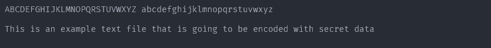
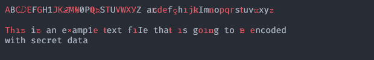
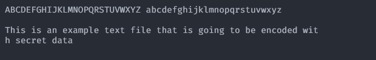
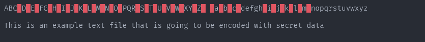

[](../../)
[](https://www.codacy.com/gh/FHPythonUtils/StegStash)
[](../../)
[](../../issues)
[](/LICENSE.md)
[](../../commits/master)
[](../../commits/master)
[](https://pypi.org/project/stegstash/)
[](https://pypi.org/project/stegstash/)

<!-- omit in toc -->
# StegStash


Provides multiple methods to hide and retrieve data.

- [Comparison to similar projects](#comparison-to-similar-projects)
- [Features](#features)
	- [Table Definitions](#table-definitions)
	- [Comparison](#comparison)
- [Roadmap](#roadmap)
- [Visual Analysis](#visual-analysis)
	- [ImageLSB](#imagelsb)
	- [Homoglyphs](#homoglyphs)
	- [ZeroWidth](#zerowidth)
- [Changelog](#changelog)
- [Install With PIP](#install-with-pip)
- [Language information](#language-information)
	- [Built for](#built-for)
- [Install Python on Windows](#install-python-on-windows)
	- [Chocolatey](#chocolatey)
	- [Download](#download)
- [Install Python on Linux](#install-python-on-linux)
	- [Apt](#apt)
- [How to run](#how-to-run)
	- [With VSCode](#with-vscode)
	- [From the Terminal](#from-the-terminal)
- [How to update, build and publish](#how-to-update-build-and-publish)
- [Community Files](#community-files)
	- [Licence](#licence)
	- [Changelog](#changelog-1)
	- [Code of Conduct](#code-of-conduct)
	- [Contributing](#contributing)
	- [Security](#security)
	- [Support](#support)

## Comparison to similar projects
Do let me know if any of these are incorrect. Some of the comparisons are
based off documentation/ the readme

|Name|ImageLSB|SoundLSB|Homoglyphs|FileAppend|MsOffice|ODF|ZeroWidth|
|---|---|---|---|---|---|---|---|
|StegStash|:heavy_check_mark:\*|:heavy_check_mark:\*|:heavy_check_mark:|:heavy_check_mark:|:heavy_check_mark:|:heavy_check_mark:|:heavy_check_mark:|
|steghide|:heavy_check_mark:\*|:heavy_check_mark:\*|:x:|:x:|:x:|:x:|:x:|
|stego-lsb|:heavy_check_mark:|:heavy_check_mark:|:x:|:x:|:x:|:x:|:x:|
|steg|:heavy_check_mark:|:x:|:x:|:x:|:x:|:x:|:x:|
|stegano|:heavy_check_mark:|:x:|:x:|:x:|:x:|:x:|:x:|
|steganer|:heavy_check_mark:|:x:|:x:|:x:|:x:|:x:|:x:|


```none
* Uses some other clever trickery to make LSB harder to detect
```

## Features


### Table Definitions
- *Hide to a basic level* - the process of hiding data in a way that may be
identified through moderately simple detection methods
- *Hide with mapping* - hiding the data using a map to do so
- *Hide reasonably well* - hiding data in a way that may not
be reliably identified through moderately simple detection methods
- *Hide and Encrypt* - the process of encrypting data so that if/ when it is
recovered, there is a decreased chance of successful extraction
- *Detection* - the process of identifying if there is a high chance of hidden
data. Use `detectSteg` for this.
- *Visual* - perform some sort of visual analysis to identify potential hidden
data. Use `visual` for this.

### Comparison

|Module|Hide to a basic level|Hide with mapping|Hide reasonably well|Hide and Encrypt|Detection|Visual|
|---|---|---|---|---|---|---|
|`imagelsb`|:heavy_check_mark:|:heavy_check_mark:|:heavy_check_mark:|:heavy_check_mark:|:x:|:heavy_check_mark:|
|`soundlsb`|:heavy_check_mark:|:heavy_check_mark:|:heavy_check_mark:|:heavy_check_mark:|:x:|:x:|
|`homoglyphs`|:heavy_check_mark:|:heavy_check_mark:|:x:|:heavy_check_mark:|:heavy_check_mark:|:heavy_check_mark:|
|`fileappend`|:heavy_check_mark:|:x:|:x:|:heavy_check_mark:|:heavy_check_mark:|:x:|
|`msoffice`|:heavy_check_mark:|:x:|:x:|:heavy_check_mark:|:heavy_check_mark:|:x:|
|`odf`|:heavy_check_mark:|:x:|:x:|:heavy_check_mark:|:heavy_check_mark:|:x:|
|`zerowidth`|:heavy_check_mark:|:heavy_check_mark:|:x:|:heavy_check_mark:|:heavy_check_mark:|:heavy_check_mark:|


- `imagelsb`

  Use LSB steganography to encode and optionally encrypt and set up a mapping for
  data.
- `homoglyphs`

  Use similar characters to hide data and optionally encrypt and set up a mapping for
  data.
- `soundlsb`

  Use LSB steganography to encode and optionally encrypt and set up a mapping for
  data.
- `fileappend`

  Append data to various file formats
- `msoffice`

  Use file inclusion and XML comments to hide data in Microsoft Office documents
- `odf`

  Use file inclusion and XML comments to hide data in OpenOffice/ LibreOffice documents
- `zerowidth`

  Use zero length chars to encode data

## Roadmap
For completed components, see the changelog (link below)

- `fileappend`

  can probably append to all sorts of formats so investigate this more


## Visual Analysis

### ImageLSB


The use of simple lsb steganography can be seen in the top left of the bottom image

### Homoglyphs





The use of homoglyph steganography can be seen in the bottom image

### ZeroWidth





Use of zero width character steganography can be seen in the bottom image


## Changelog
See the [CHANGELOG](/CHANGELOG.md) for more information.

## Install With PIP

```python
pip install stegstash
```

Head to https://pypi.org/project/stegstash/ for more info

## Language information
### Built for
This program has been written for Python 3 and has been tested with
Python version 3.8.0 <https://www.python.org/downloads/release/python-380/>.

## Install Python on Windows
### Chocolatey
```powershell
choco install python
```
### Download
To install Python, go to <https://www.python.org/> and download the latest
version.

## Install Python on Linux
### Apt
```bash
sudo apt install python3.8
```

## How to run
### With VSCode
1. Open the .py file in vscode
2. Ensure a python 3.8 interpreter is selected (Ctrl+Shift+P > Python:Select
Interpreter > Python 3.8)
3. Run by pressing Ctrl+F5 (if you are prompted to install any modules, accept)
### From the Terminal
```bash
./[file].py
```

## How to update, build and publish

1. Ensure you have installed the following dependencies
	Linux
	```bash
	wget dephell.org/install | python3.8
	wget https://raw.githubusercontent.com/python-poetry/poetry/master/get-poetry.py | python3.8
	```
	Windows
	```powershell
	(wget dephell.org/install -UseBasicParsing).Content | python
	(wget https://raw.githubusercontent.com/python-poetry/poetry/master/get-poetry.py -UseBasicParsing).Content | python
	```
2. Use poetry for the heavy lifting and dephell to generate requirements
	```bash
	poetry update
	dephell deps convert
	```
3. Build/ Publish
	```bash
	poetry build
	poetry publish
	```
	or
	```bash
	poetry publish --build
	```
## Community Files
### Licence
MIT License
Copyright (c) FredHappyface
(See the [LICENSE](/LICENSE.md) for more information.)

### Changelog
See the [Changelog](/CHANGELOG.md) for more information.

### Code of Conduct
In the interest of fostering an open and welcoming environment, we
as contributors and maintainers pledge to make participation in our
project and our community a harassment-free experience for everyone.
Please see the
[Code of Conduct](https://github.com/FHPythonUtils/.github/blob/master/CODE_OF_CONDUCT.md) for more information.

### Contributing
Contributions are welcome, please see the [Contributing Guidelines](https://github.com/FHPythonUtils/.github/blob/master/CONTRIBUTING.md) for more information.

### Security
Thank you for improving the security of the project, please see the [Security Policy](https://github.com/FHPythonUtils/.github/blob/master/SECURITY.md) for more information.

### Support
Thank you for using this project, I hope it is of use to you. Please be aware that
those involved with the project often do so for fun along with other commitments
(such as work, family, etc). Please see the [Support Policy](https://github.com/FHPythonUtils/.github/blob/master/SUPPORT.md) for more information.
